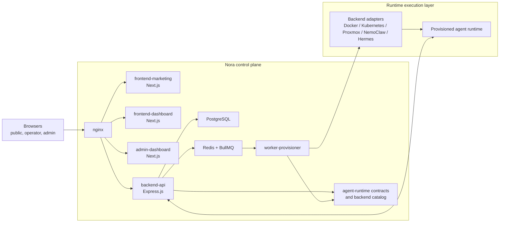
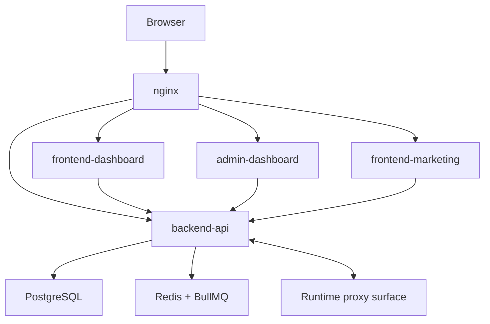
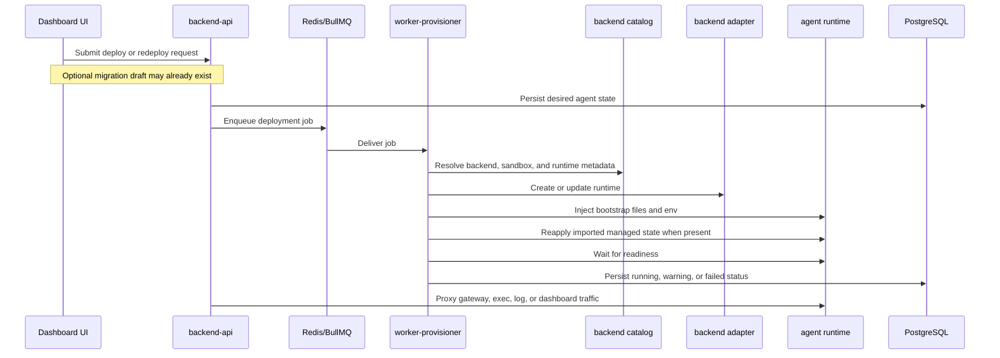
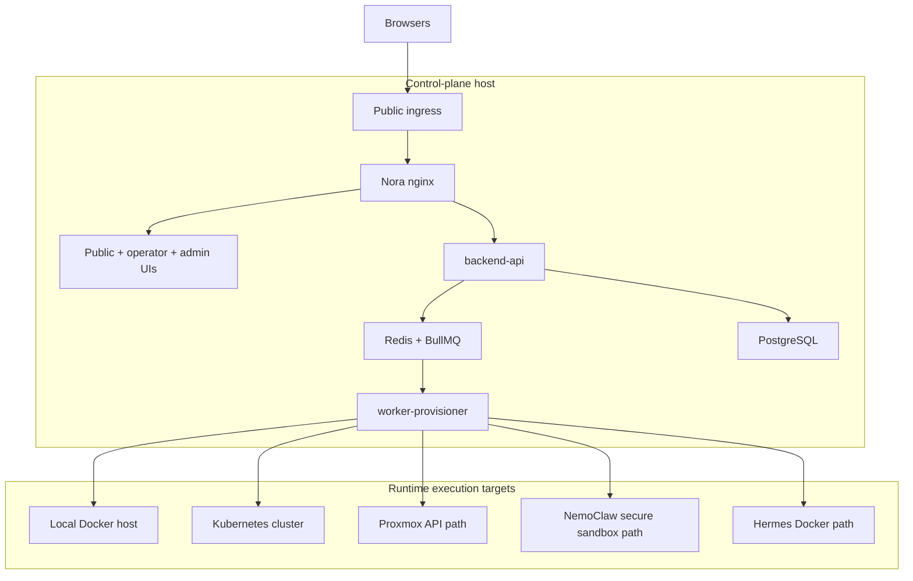

# Nora System Overview

**Reviewed for release:** Unreleased

This is the canonical public architecture document for Nora. Update it whenever the control plane, provisioning model, deployment topology, or trust boundaries change. Release-prep PRs must refresh the `Reviewed for release:` marker.

## Summary

Nora is an operator-facing control plane for AI agent runtimes. It presents three browser surfaces behind one ingress, stores platform state in PostgreSQL, coordinates background work through Redis and BullMQ, provisions or proxies runtimes through backend adapters, and now stages migration drafts plus controlled runtime file access through the same API surface.

The public repo currently centers on a single control-plane host. Agent workloads can stay on the local Docker host or be placed onto supported external execution targets without changing the operator workflow.

## System Map

## Major Components

| Component | Repo surface | Role |
|---|---|---|
| Public and auth UI | `frontend-marketing/` | Landing pages, signup, login, and public entrypoint routes. |
| Operator workspace | `frontend-dashboard/` | Deployments, migration/import, fleet operations, filesystem access, logs, settings, Agent Hub, and runtime interaction surfaces. |
| Admin workspace | `admin-dashboard/` | Fleet-wide administration, moderation, audit, and platform settings. |
| Reverse proxy | `nginx.conf`, `nginx.public.conf`, `infra/` | Routes browser traffic to the correct UI or API surface and carries streaming traffic. |
| Control-plane API | `backend-api/` | Auth, persistence, migration staging, filesystem mediation, queue orchestration, monitoring, Agent Hub logic, runtime coordination, and runtime proxy endpoints. |
| Durable state | PostgreSQL | Stores accounts, agents, templates, migration drafts, managed runtime state, settings, deployments, events, and other platform state consumed by the control plane. |
| Queue and worker handoff | Redis + BullMQ | Carries deployment jobs, retries, and failed-job inspection state between the API and worker. |
| Provisioning worker | `workers/provisioner/` | Resolves backend choice, injects bootstrap state, applies imported managed state, waits for readiness, and persists warnings or status. |
| Runtime contract package | `agent-runtime/` | Shared runtime-side files, ports, endpoint conventions, bootstrap helpers, and backend metadata used by the API and worker. |

## Control Plane

### Request Routing

### API Responsibilities

`backend-api/server.ts` is the control-plane integration hub. It wires together:

- security middleware such as Helmet, CORS, rate limiting, and request correlation
- public health and configuration endpoints
- auth routes
- authenticated route families for agents, migration drafts, controlled file access, channels, monitoring, integrations, workspaces, billing, Agent Hub, and admin operations
- gateway and runtime proxy handlers for chat, gateway UI, health, logs, and terminal-adjacent streaming
- release metadata used by the admin-facing upgrade surfaces

### State And Queue Boundaries

| Service | What it stores or carries |
|---|---|
| PostgreSQL | Users, agents, deployments, migration drafts, agent secret overrides, Hermes persisted runtime state, platform settings, snapshots, Agent Hub content, integrations, channels, metrics, events, workspaces, and subscriptions. |
| Redis + BullMQ | Deployment job handoff, retries, timeouts, and failed-job inspection state. |

The API persists desired state first, then hands long-running work to the queue-backed worker. That keeps provisioning failures, retries, and delayed readiness out of the synchronous browser request path.

## Migration And Filesystem Contract

### Migration Flow

Nora now ships a control-plane-managed migration path for both `openclaw` and `hermes`:

1. The operator prepares a migration draft from either:
   - an uploaded Nora migration bundle or legacy OpenClaw template JSON
   - a live Docker source
   - a live SSH source
2. `backend-api/agentMigrations.ts` normalizes the imported data and stores an encrypted manifest in PostgreSQL.
3. The operator deploys a new Nora-managed agent using that draft.
4. The provisioning worker recreates the runtime under Nora control instead of adopting the original runtime in place.

That distinction matters: Nora does not bind to the legacy runtime as-is. It uses the draft as desired state for a fresh Nora-managed deployment.

### Import Surface

The current public import contract is intentionally scoped:

- `openclaw`: agent files, workspace content, session memory, and provider material Nora can extract from supported source files
- `hermes`: workspace content, model config, supported Hermes channel config, and provider environment material
- both families: supported Nora-managed state such as imported provider records, channel/integration wiring where available, and per-agent secret overrides

Unsupported runtime-specific state is surfaced as draft warnings instead of being silently invented or applied.

### Export And Live Files

- Nora-managed agents can be exported as `nora-migration-bundle/v1` bundles for recreation on another Nora control plane.
- The agent detail Files tab reads the actual runtime filesystem through `backend-api/agentFiles.ts`.
- Filesystem access is root-allowlisted:
  - writable workspace root
  - curated read-only system roots for inspection and download
- The browser never receives arbitrary host filesystem access; all reads and writes are mediated through runtime-aware backend commands.

## Runtime Provisioning

### Selection Model

Nora chooses a concrete backend through three layers of intent:

| Layer | Current values | Meaning |
|---|---|---|
| Runtime family | `openclaw`, `hermes` | Which operator contract the runtime satisfies. |
| Deploy target | `docker`, `k8s`, `proxmox` | Where the runtime should be scheduled. |
| Sandbox profile | `standard`, `nemoclaw` | Which isolation profile should wrap the runtime. |

The worker resolves the final backend through shared metadata in `agent-runtime/lib/backendCatalog.ts`.

### Current Runtime Paths

| Backend path | Runtime family | Maturity | Notes |
|---|---|---|---|
| OpenClaw + Docker | `openclaw` | GA | Recommended default path for most self-hosted installs. |
| OpenClaw + Kubernetes | `openclaw` | Beta | Uses Kubernetes workloads instead of the local Docker host. |
| OpenClaw + Proxmox | `openclaw` | Blocked | Visible in the catalog, but intentionally not treated as release-ready in the current build. |
| NemoClaw + OpenClaw | `openclaw` | Experimental | Uses NVIDIA secure sandboxing with a stronger isolation profile. |
| Hermes + Docker | `hermes` | Experimental | Docker-managed path with a narrower runtime contract and its own dashboard surface. |

### Provisioning Lifecycle

### Bootstrap Contract

The worker and backend adapters share one runtime bootstrap package from `agent-runtime/`:

- runtime library files are injected into the launched environment
- template payload files are copied into the runtime workspace when present
- runtime environment variables are assembled centrally
- endpoint conventions stay shared across the worker and API

The current shared ports are:

| Port | Purpose |
|---|---|
| `9090` | Nora runtime-side HTTP contract |
| `18789` | OpenClaw gateway port |
| `9119` | Hermes dashboard port |

### Operator Contract Differences

The runtime family determines which operator capabilities Nora expects after launch:

- `openclaw`: deploy/redeploy, readiness, gateway/chat, logs, exec, bootstrap/template files, migration import/export, live filesystem access, and auth/integration sync
- `hermes`: deploy/redeploy, readiness, logs, exec, migration import/export, live filesystem access, supported persisted model/channel state, and provider/integration env sync

## Deployment Topologies

### Topology Matrix

| Topology | Ingress owner | Control plane placement | Agent placement | Best fit |
|---|---|---|---|---|
| Local single-host | Nora nginx on `NGINX_HTTP_PORT` | One Docker Compose host | Local Docker by default | Evaluation, local proof, small self-hosted installs |
| Public domain with Nora-managed ingress | Nora nginx on public ports | One Docker Compose host | Local Docker or supported external targets | Straightforward public self-hosting |
| Public domain behind external reverse proxy | Host or upstream proxy terminates public traffic and forwards to Nora | One Docker Compose host | Local Docker or supported external targets | Existing nginx, Cloudflare, or host-managed TLS setups |
| External runtime targets | Same ingress as above | One Docker Compose host | Kubernetes, Proxmox, or specialized sandbox paths | Teams that need different runtime placement without changing the operator workflow |

### Topology Map

The clearest public path today is still one host running the control plane, with agent runtimes launched locally through Docker by default. Public-domain setups can either let Nora own public ingress directly or put an external reverse proxy in front of Nora's internal nginx.

## Trust Boundaries

- Browsers never talk directly to PostgreSQL or Redis. All browser traffic enters through nginx and reaches stateful services through the frontends or `backend-api/`.
- `backend-api/` owns auth, persistence, queue orchestration, release metadata, and runtime-facing proxy routes. Frontends do not provision runtimes directly.
- `backend-api/` also owns migration draft inspection/storage and all runtime file access mediation. Browser users do not receive direct host or container filesystem access.
- `workers/provisioner/` handles long-running infrastructure work outside the request path. It consumes queued jobs and writes the result back into control-plane state.
- `agent-runtime/` defines the runtime-side contract used after launch. Control-plane code depends on that contract rather than embedding backend-specific assumptions everywhere.
- External execution systems such as Docker, Kubernetes, Proxmox, and NVIDIA secure sandboxes are reached through backend adapters instead of directly from browser surfaces.

## Current Constraints

- The public OSS path is primarily a single-host control plane. The repo does not currently claim a first-class HA or distributed control-plane deployment story.
- OpenClaw is the default runtime family. Hermes is available as a narrower, deployment-first runtime path with a different operator contract.
- Migration recreates runtimes under Nora control; it does not adopt a legacy runtime in place.
- Hermes remains Docker-only in the current public runtime catalog, and Hermes import applies only the supported Nora-managed/runtime state described above.
- Kubernetes, Proxmox, and NemoClaw are execution-target options for agents, not separate control-plane products.
- Public architecture docs should describe current repo behavior and supported paths honestly, without inventing private-only operating procedures or future guarantees.
